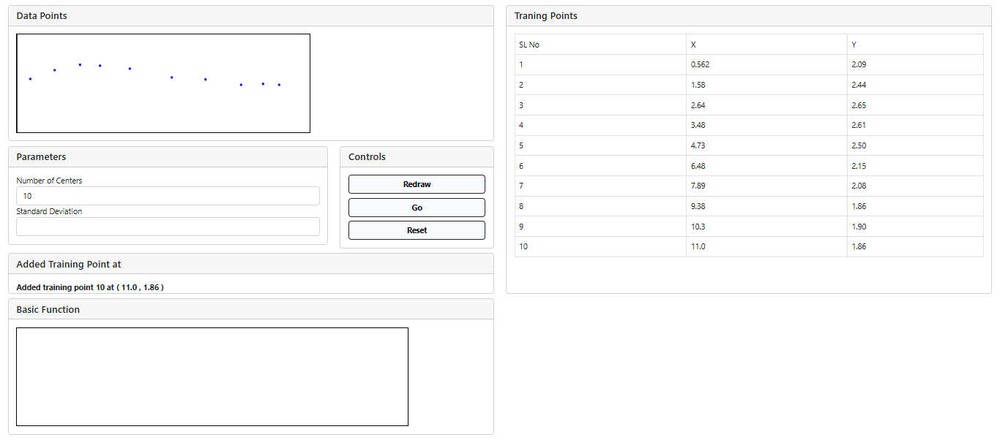
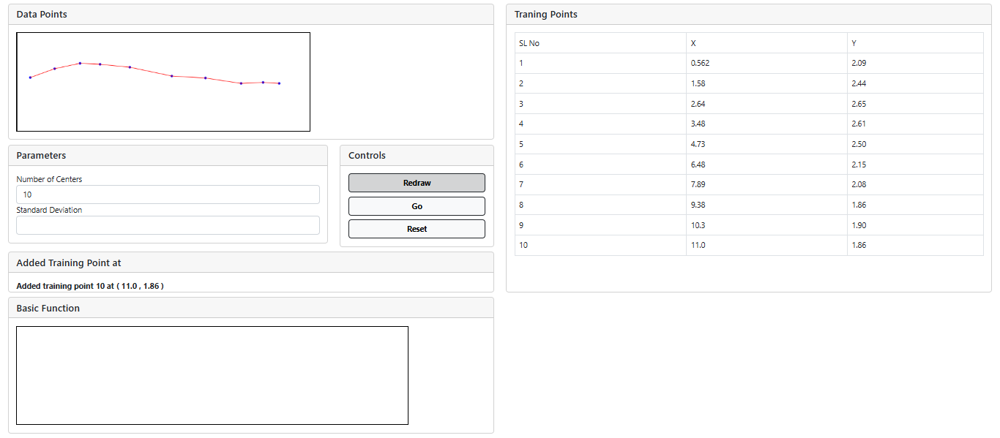
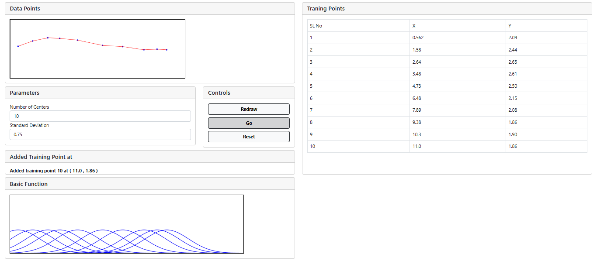
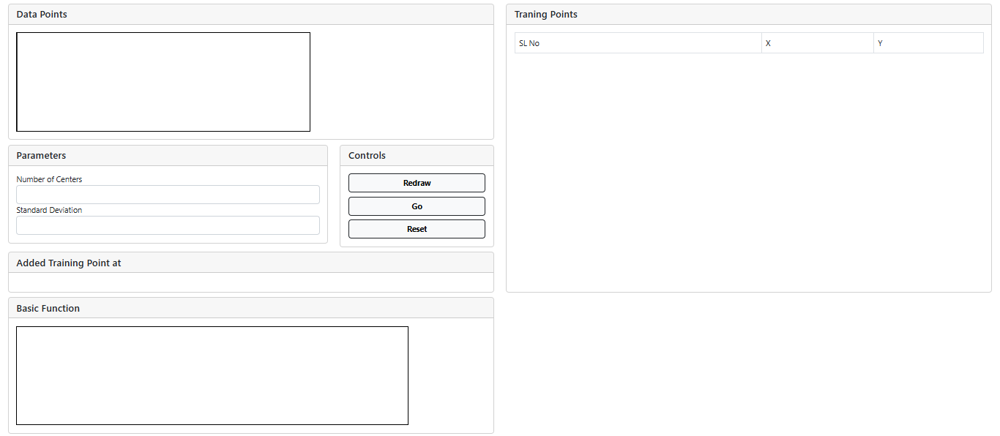

### Procedure
1. Click on Board Area to plot the training points in the data points section (data points be equal to number of centers).

2. Click on "Redraw" button to draw the sequence on the "Data Points"

3. Click on "Go" button to see the result to the problem achieved using Radial Basis Function. 

4. Click on "Reset" button and restart the experiment.
