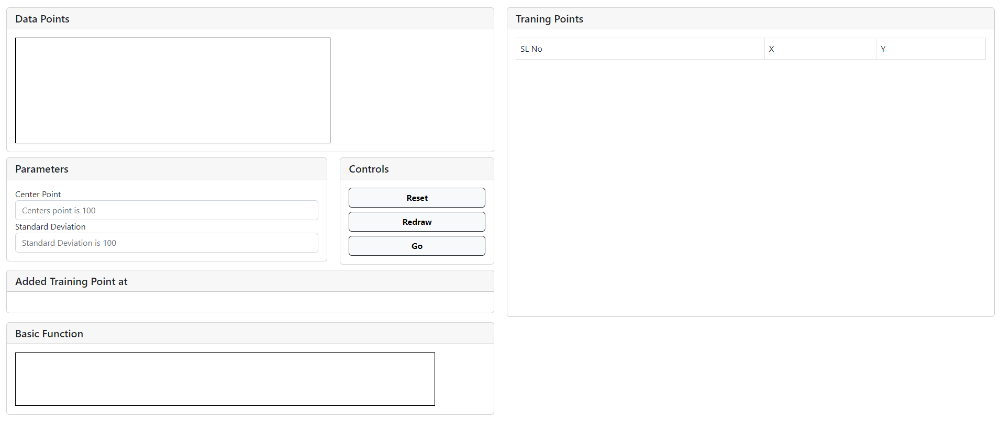
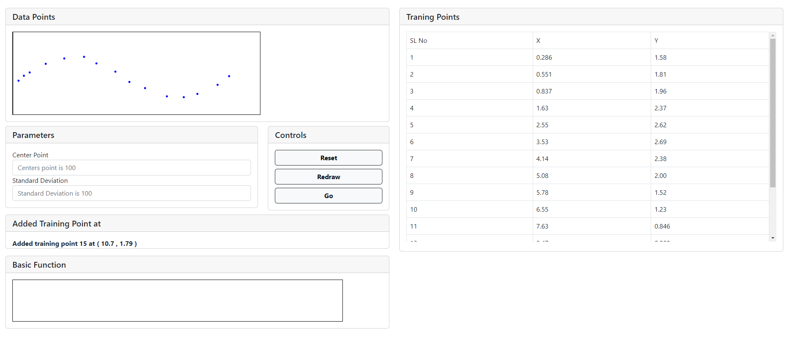
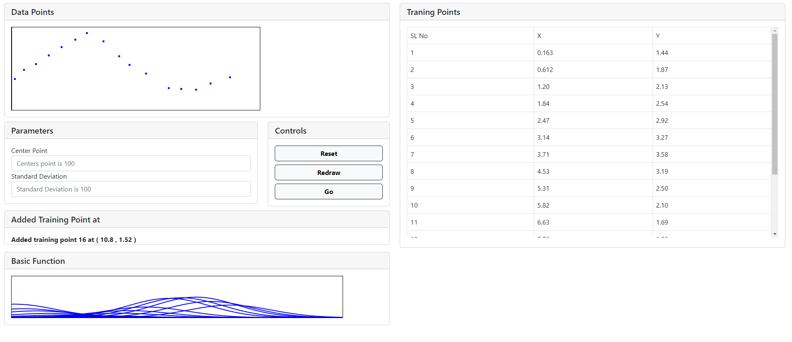
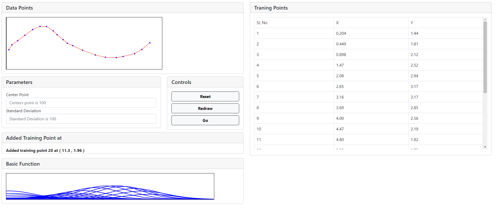

### Procedure
1. Click on Board Area to plot the training points in the data points section

2. You do not have to put the center point and the standard deviation as those two are fixed.

3. Click on the "Go" button to plot the basis function

4. Click the "Redraw" button to draw the sequence on the "Data Points" section

5. Click on "Reset" button to reset the entire thing.

