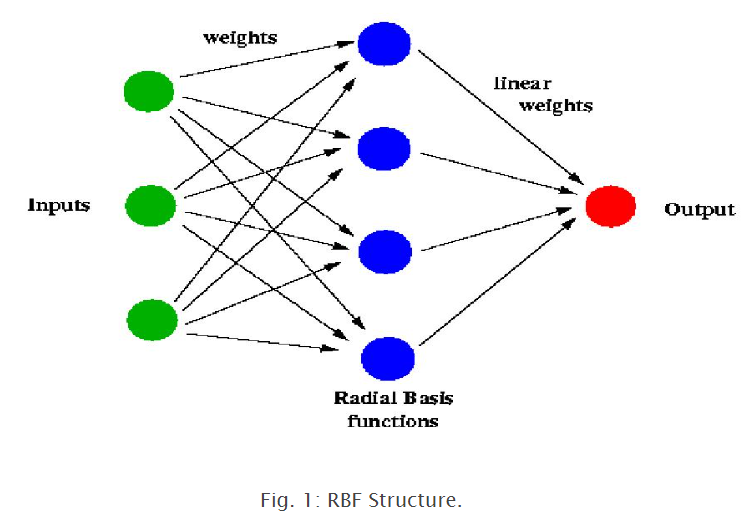
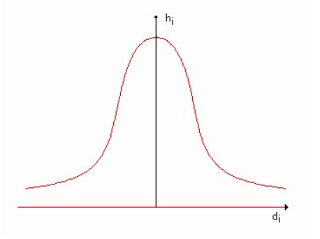

## Introduction

Radial basis function (RBF) networks are feed-forward networks trained using a supervised training algorithm. They are typically configured with a single hidden layer of units whose activation function is selected from a class of functions called basis functions. While similar to back propagation in many respects, radial basis function networks have several advantages. They usually train much faster than back propagation networks. They are less susceptible to problems with non-stationary inputs because of the behavior of the radial basis function hidden units.

Popularized by Moody and Darken (1989), RBF networks have proven to be a useful neural network architecture. The major difference between RBF networks and back propagation networks (that is, multi layer perceptron trained by Back Propagation algorithm) is the behavior of the single hidden layer. Rather than using the sigmoidal or S-shaped activation function as in back propagation, the hidden units in RBF networks use a Gaussian or some other basis kernel function. Each hidden unit acts as a locally tuned processor that computes a score for the match between the input vector and its connection weights or centers. In effect, the basis units are highly specialized pattern detectors. The weights connecting the basis units to the outputs are used to take linear combinations of the hidden units to product the final classification or output.

## Theory

Radial Basis Functions are first introduced in the solution of the real multivariable interpolation problems. Broomhead and Lowe (1988), and Moody and Darken (1989) were the first to exploit the use of radial basis functions in the design of neural networks.

The structure of an RBF networks in its most basic form involves three entirely different layers: an input layer, a hidden layer with a non-linear RBF activation function and an output layer with linear activation functions.

**Input Layer**: The input layer is made up of source nodes (sensory units) whose number is equal to the dimension of the input vector.

**Hidden Layer**: The second layer is the hidden layer which is composed of nonlinear units that are connected directly to all of the nodes in the input layer. It is of high enough dimension, which serves a different purpose from that in a multilayer perceptron. Each hidden unit takes its input from all the nodes at the components at the input layer. As mentioned above the hidden units contains a basis function, which has the parameters center and width. The center of the basis function for a node *i* at the hidden layer is a vector ci whose size is the as the input vector *u* and there is normally a different center for each unit in the network. First, the radial distance di, between the input vector *u* and the center of the basis function ci is computed for each unit *i* in the hidden layer using the Eucledian distance:

$$
\begin{align*}
d_i &= ||u - c_i|| \\
\end{align*}
$$

The output *hi* of each hidden unit *i* is then computed by applying the basis function *G* to this distance:

$$
\begin{align*}
h_i &= G(d_i, σ_i) \\
\end{align*}
$$

As it is shown in Figure 2, the basis function is a curve (typically a Gaussian function, the width corresponding to the variance, *σi*) which has a peak at zero distance and it decreases as the distance from the center increases.

**Output Layer**: The transformation from the input space to the hidden unit space is nonlinear, whereas the transformation to the hidden unit space to the output space is linear. The *jth* output is computed as:

$$
\begin{align*}
x_j &= f_j(u) &= w_{0j} &+ \sum_{i=1}^{L} (w_{ij}h_i) &&&&&& j = 1,2,3,....,M\\
\end{align*}
$$

**Mathematical Model**:In summary, the mathematical model of the RBF network can be expressed as:

$$
\begin{align*}
x &= f(u), f:R^N \to R^M\\
\end{align*}
$$

$$
\begin{align*}
x_j &= f_j(u) &= w_{0j} &+ \sum_{i=1}^{L} (w_{ij}G(||u - c_i||)) &&&&&& j=1,2,3,.....,M\\
\end{align*}
$$

where *di* is the the Euclidean distance between *u* and *ci*.

<script src="https://cdn.jsdelivr.net/npm/mathjax@3/es5/tex-mml-chtml.js">
